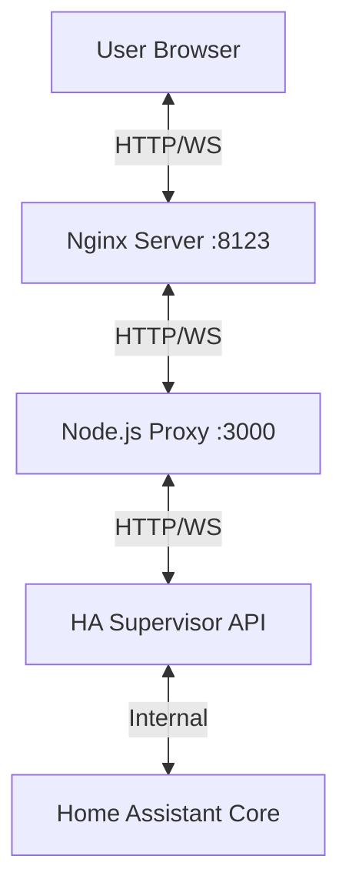

# Nexdom Dashboard - Architecture & Development Guide

This document explains the architecture of the Nexdom Dashboard, specifically focusing on the Home Assistant integration, data flow, and key files involved in recent updates.

## 🏗️ Architecture Overview

The application is a **React** frontend (Vite) served by an **Nginx** server, communicating with a **Node.js** backend proxy. This backend proxy handles the connection to the Home Assistant Supervisor API.

### Key Components

1.  **Frontend (`src/`)**: React application using Zustand for state (though HA integration uses a custom hook).
2.  **Backend Proxy (`backend/`)**: Node.js Express + WebSocket server. It proxies requests to the Supervisor API and handles authentication.
3.  **Add-on Config (`ha-addon/`)**: Configuration for running as a Home Assistant Add-on.

## 🔄 Data Flow (Home Assistant Integration)

### 1. Connection & Authentication
- **File**: `src/components/dashboard/HomeAssistant.tsx`
- The frontend connects to `/ws` (proxied to backend).
- Backend connects to Supervisor WebSocket.
- Backend handles authentication with `HASSIO_TOKEN`.
- Backend sends `auth_ok` to frontend.

### 2. Initial Data Load
- **File**: `src/components/dashboard/HomeAssistant.tsx` (`handleWebSocketMessage`)
- Upon `auth_ok`, frontend requests:
    - `get_states`: All entity states.
    - `config/area_registry/list`: Areas (zones).
    - `config/entity_registry/list`: Entity registry.
    - `config/device_registry/list`: Device registry (for mapping entities to areas).

### 3. State Updates (Real-time)
- **File**: `src/components/dashboard/HomeAssistant.tsx`
- Frontend subscribes to `state_changed` events.
- When HA state changes -> Supervisor -> Backend -> Frontend.
- `useHomeAssistant` hook updates `entities` state.
- **Critical**: A `useEffect` triggers `createZonesFromEntities` to update the UI whenever `entities` change.

### 4. Service Calls (Actions)
- **File**: `src/components/dashboard/HomeAssistant.tsx` (`callService`, `toggleEntity`)
- Frontend sends `call_service` message via WebSocket.
- Backend translates the ID and forwards to Supervisor.
- Supervisor executes action in HA Core.

## 📂 Key Files for Development

### Frontend Logic
- **`src/components/dashboard/HomeAssistant.tsx`**: The brain. Handles WebSocket connection, state management, and zone creation logic.
    - `useHomeAssistant`: Hook used by components to access data.
    - `createZonesFromEntities`: Logic that groups entities into zones based on Area ID.

### UI Components
- **`src/components/dashboard/zones/ZonesPanel.tsx`**: Main view displaying zones and devices.
    - Handles icon mapping (`getIconName`).
    - Handles click actions (`toggleEntity`, opening modal).
- **`src/components/dashboard/templates/GadgetCard.tsx`**: Individual device card.
    - Displays status, icon, and action buttons.
- **`src/components/dashboard/modals/DeviceDetailsModal.tsx`**: Modal for detailed controls (brightness, temp, etc.).

### Backend
- **`backend/src/server.js`**: The proxy server.
    - **Critical**: Implements ID translation (`messageMap`) to prevent `id_reuse` errors when multiple clients connect.

## 🛠️ Common Tasks

### Adding a New Device Type
1.  Update `getIconName` in `ZonesPanel.tsx` to map the domain to a Lucide icon.
2.  Update `DeviceDetailsModal.tsx` to add controls for the new domain.
3.  Update `toggleEntity` in `HomeAssistant.tsx` if it needs a specific service call (e.g., `lock.unlock`).

### Debugging Connection
- Check browser console for `[Nexdom]` logs.
- Check `[WS]` logs in the add-on logs for backend proxy activity.
- Verify `HASSIO_TOKEN` is present in `run.sh`.
